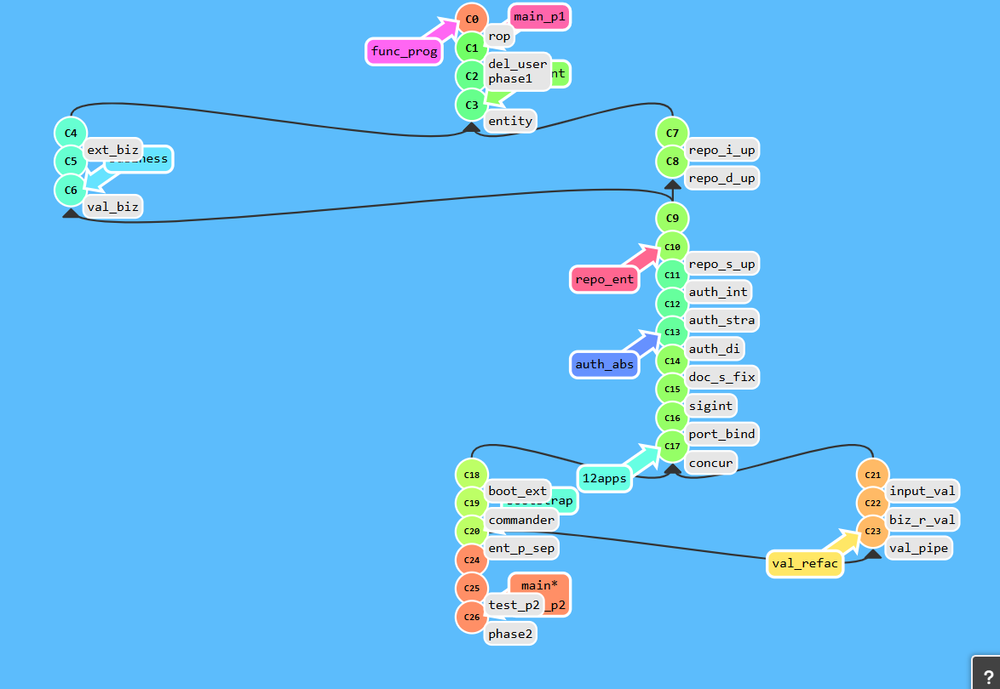
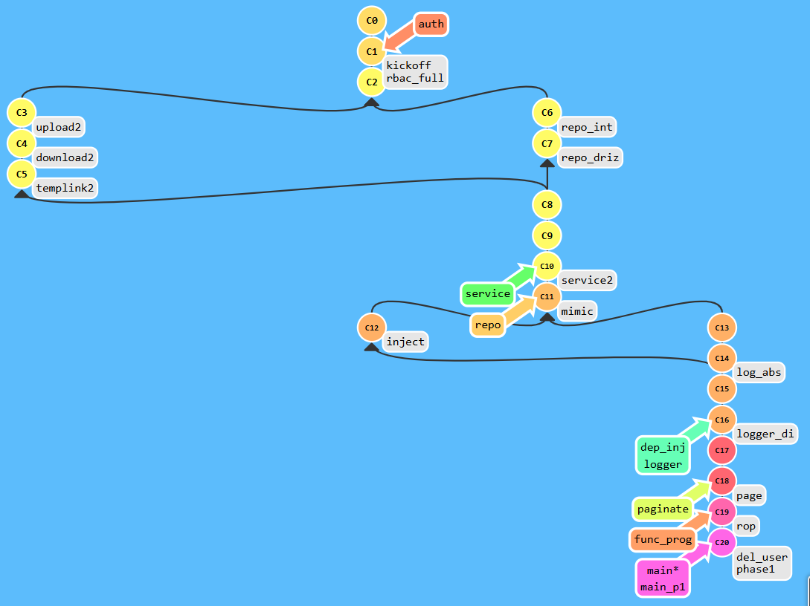

# Headless-DMS 
## Backend Training-Carbonteq
### Raafay Saeed Kazmi-CT-149


**Current Completed Phase: Refactor Phase**

# Refactor Phase 2 

## Overview
Phase 2 successfully transformed the Document Management System from a monolithic structure to a clean, testable, and maintainable architecture following Clean Architecture principles, Domain-Driven Design, and 12 Factor App methodology.

---

## Git History Graph



---

## Files Structure After Phase 2

```
headless-dms/
├── src/
│   ├── app.ts                          # Clean entry point
│   ├── bootstrap/                      # Application bootstrap
│   │   ├── index.ts                   # Main orchestrator
│   │   ├── config.ts                  # Configuration management
│   │   ├── database.ts                # Database initialization
│   │   ├── server.ts                  # Server setup
│   │   └── signals.ts                 # Signal handling
│   ├── commander/                     # CLI argument parsing
│   │   └── cli.ts
│   ├── domain/                        # Domain layer
│   │   ├── entities/                  # Domain entities
│   │   │   ├── User.ts
│   │   │   └── Document.ts
│   │   └── validators/                # Business rule validators
│   │       ├── UserValidator.ts
│   │       └── DocumentValidator.ts
│   ├── auth/                          # Authentication layer
│   │   ├── interfaces/                # Auth abstractions
│   │   │   ├── IAuthHandler.ts
│   │   │   └── IAuthStrategy.ts
│   │   ├── strategies/                # Auth implementations
│   │   │   ├── JwtAuthStrategy.ts
│   │   │   └── LocalAuthStrategy.ts
│   │   ├── services/                  # Auth services
│   │   │   └── AuthHandler.ts
│   │   ├── repositories/              # User data access
│   │   │   ├── user.repository.interface.ts
│   │   │   └── drizzle-user.repository.ts
│   │   ├── routes/                    # Auth routes
│   │   │   └── auth.routes.ts
│   │   └── middleware/                # Auth middleware
│   │       ├── authenticate.ts
│   │       └── roleGuard.ts
│   ├── documents/                     # Document management
│   │   ├── repositories/              # Document data access
│   │   │   ├── documents.repository.interface.ts
│   │   │   └── drizzle-document.repository.ts
│   │   ├── services/                  # Document services
│   │   │   └── documents.service.ts
│   │   └── routes/                    # Document routes
│   │       └── documents.routes.ts
│   ├── http/                          # HTTP layer
│   │   ├── server.ts                  # HTTP server setup
│   │   ├── middleware.ts              # HTTP middleware
│   │   └── routes.ts                  # HTTP routes
│   ├── validation/                    # Validation layer
│   │   ├── schemas/                   # Zod schemas
│   │   │   └── common.schemas.ts
│   │   ├── technical/                 # Technical validation
│   │   │   ├── input.validator.ts
│   │   │   ├── format.validator.ts
│   │   │   └── simple.validator.ts
│   │   ├── pipeline/                  # Validation pipeline
│   │   │   ├── orchestrator.ts
│   │   │   └── error-formatter.ts
│   │   └── middleware/                # Validation middleware
│   │       ├── validation.middleware.ts
│   │       └── error-handler.middleware.ts
│   ├── common/                        # Shared components
│   │   ├── container.ts               # DI container
│   │   ├── dto/                       # Data transfer objects
│   │   │   └── pagination.dto.ts
│   │   └── services/                  # Shared services
│   │       ├── logger.service.interface.ts
│   │       └── file.service.interface.ts
│   ├── db/                           # Database layer
│   │   ├── index.ts                   # Database connection
│   │   └── schema.ts                  # Database schema
│   └── pipes/                        # Legacy validation (deprecated)
│       └── zod-validation.pipe.ts
├── tests/                            # Test suite
│   ├── domain/                       # Domain tests
│   │   ├── user.test.ts
│   │   └── document.test.ts
│   ├── validators/                   # Validator tests
│   │   ├── user-validator.test.ts
│   │   └── document-validator.test.ts
│   ├── repositories/                 # Repository tests
│   │   ├── user-repository.test.ts
│   │   └── document-repository.test.ts
│   ├── services/                     # Service tests
│   │   ├── user-service.test.ts
│   │   └── document-service.test.ts
│   └── run-all-tests.js             # Test orchestrator
├── uploads/                          # File uploads
├── drizzle/                          # Database migrations
├── package.json                      # Dependencies and scripts
├── tsconfig.json                     # TypeScript configuration
└── README.md                         # Documentation
```

---

## Route Tree

```
└── /
    ├── ping (GET, HEAD)
    ├── health (GET, HEAD)
    ├── documents (GET, HEAD)
    │   └── / (GET, HEAD)
    │       ├── upload (POST)
    │       ├── download (GET, HEAD)
    │       └── :id (GET, HEAD, PATCH, DELETE)
    │           └── /download-link (GET, HEAD)
    └── auth/
        ├── login (POST)
        ├── register (POST)
        └── users (GET, HEAD)
            └── /
                └── :id (GET, HEAD, DELETE)
                    └── /
                        ├── role (PATCH)
                        └── password (PATCH)
```

---

## Step 1: Entity Extraction & Domain Modeling

### 1.1 Domain Entities Creation
**Files Created:**
- `src/domain/entities/User.ts`
- `src/domain/entities/Document.ts`

**Key Features:**
- **Factory Pattern**: Static `create()` methods for entity instantiation
- **Encapsulation**: All state-changing operations within entities
- **Invariants**: Business rules enforced at creation and modification time
- **Immutability**: Entities return new instances for state changes

**User Entity Methods:**
```typescript
// Factory methods
static create(props: UserProps): Result<User, UserError>
static fromRepository(data: any): User

// State-changing operations
changeRole(newRole: 'user' | 'admin'): Result<User, UserError>
changePassword(newPassword: string): Result<User, UserError>
verifyPassword(password: string): boolean

// Business logic
hasPermission(permission: string): boolean
isAccountOlderThan(days: number): boolean
```

**Document Entity Methods:**
```typescript
// Factory methods
static create(props: DocumentProps): Result<Document, DocumentError>
static fromRepository(data: any): Document

// State-changing operations
updateName(newName: string): Result<Document, DocumentError>
replaceTags(tags: string[]): Result<Document, DocumentError>
updateMetadata(metadata: Record<string, string>): Result<Document, DocumentError>

// Business logic
isPDF(): boolean
isImage(): boolean
isTextFile(): boolean
getFileSizeInBytes(): number
getFileSizeInMB(): number
hasTag(tag: string): boolean
hasMetadata(key: string): boolean
getMetadataValue(key: string): string | undefined
isRecentlyUpdated(days: number): boolean
```

---

## Step 2: Business Rules Separation

### 2.1 Domain Validators
**Files Created:**
- `src/domain/validators/UserValidator.ts`
- `src/domain/validators/DocumentValidator.ts`

**Key Features:**
- **Separation of Concerns**: Technical validation vs. business rules
- **Invariant Checking**: Domain-specific business rules
- **Testable**: Pure functions with no external dependencies

**UserValidator Methods:**
```typescript
// Business rule validation
validatePassword(password: string): ValidationResult
validateRole(role: string): ValidationResult
validateRoleChange(currentRole: string, newRole: string): ValidationResult
validateEmail(email: string): ValidationResult

// Invariant checking
validateUserInvariants(user: User): ValidationResult
validateUserEmailInvariant(email: string): ValidationResult
validateUserRoleInvariant(role: string): ValidationResult
```

**DocumentValidator Methods:**
```typescript
// Business rule validation
validateName(name: string): ValidationResult
validateFileSize(size: string): ValidationResult
validateFileType(type: string): ValidationResult
validateTags(tags: string[]): ValidationResult
validateMetadata(metadata: Record<string, string>): ValidationResult

// Invariant checking
validateDocumentInvariants(document: Document): ValidationResult
validateDocumentIdInvariant(id: string): ValidationResult
validateDocumentNameInvariant(name: string): ValidationResult
```

---

## Step 3: Repository Entity Integration

### 3.1 Repository Interfaces
**Files Updated:**
- `src/auth/repositories/user.repository.interface.ts`
- `src/documents/repositories/documents.repository.interface.ts`

**Key Changes:**
- Repositories now work with domain entities instead of DTOs
- Return types changed from DTOs to `User` and `Document` entities
- Added proper pagination support with `PaginationOutput<T>`

### 3.2 Repository Implementations
**Files Updated:**
- `src/auth/repositories/drizzle-user.repository.ts`
- `src/documents/repositories/drizzle-document.repository.ts`

**Key Features:**
- Entity-to-database mapping using `fromRepository()` and `toRepository()`
- Database independence through interface abstraction
- Proper error handling with `Result` types

---

## Step 4: Authentication Abstraction

### 4.1 Authentication Interfaces
**Files Created:**
- `src/auth/interfaces/IAuthHandler.ts`
- `src/auth/interfaces/IAuthStrategy.ts`

**IAuthHandler Interface:**
```typescript
export interface IAuthHandler {
  register(email: string, password: string, role?: string): Promise<Result<AuthResult, AuthError>>
  login(email: string, password: string): Promise<Result<AuthResult, AuthError>>
  changeUserPassword(userId: string, newPassword: string): Promise<Result<User, AuthError>>
  changeUserRole(userId: string, newRole: 'user' | 'admin'): Promise<Result<User, AuthError>>
  getStrategyName(): string
}
```

**IAuthStrategy Interface:**
```typescript
export interface IAuthStrategy {
  authenticate(email: string, password: string): Promise<Result<User, AuthError>>
  generateToken(user: User): Promise<Result<string, AuthError>>
  verifyToken(token: string): Promise<Result<DecodedToken, AuthError>>
  getStrategyName(): string
}
```

### 4.2 Authentication Strategies
**Files Created:**
- `src/auth/strategies/JwtAuthStrategy.ts`
- `src/auth/strategies/LocalAuthStrategy.ts`

**JwtAuthStrategy Features:**
- JWT token generation and verification
- Password hashing with bcrypt
- Role-based authentication

**LocalAuthStrategy Features:**
- In-memory user storage for testing
- Simplified authentication for development
- No external dependencies

### 4.3 Authentication Handler
**Files Created:**
- `src/auth/services/AuthHandler.ts`

**Key Features:**
- Implements `IAuthHandler` interface
- Delegates to injected `IAuthStrategy`
- Handles business logic and error coordination
- Uses dependency injection for strategy selection

---

## Step 5: 12 Factor App Implementation

### 5.1 Process Management
**Files Created:**
- `src/bootstrap/signals.ts`

**Key Features:**
- Graceful shutdown handling for SIGTERM, SIGINT, SIGBREAK
- Process state management (`isShuttingDown`, `shutdownStartTime`)
- Server cleanup and resource release
- Windows-specific signal handling

### 5.2 Port Binding
**Files Created:**
- `src/bootstrap/config.ts`

**Key Features:**
- Environment variable configuration
- Dynamic port binding with fallbacks
- Configuration validation using Zod schemas
- Health check endpoints (`/ping`, `/health`)

**Configuration Schema:**
```typescript
const ConfigSchema = z.object({
  PORT: z.string().transform(val => parseInt(val, 10)).pipe(z.number().min(1).max(65535)).default(3000),
  HOST: z.string().default('0.0.0.0'),
  NODE_ENV: z.enum(['development', 'production', 'test']).default('development'),
  DB_HOST: z.string().default('localhost'),
  DB_PORT: z.string().transform(val => parseInt(val, 10)).pipe(z.number().min(1).max(65535)).default(5432),
  DB_USER: z.string(),
  DB_PASSWORD: z.string(),
  DB_NAME: z.string(),
  DB_SSL: z.string().transform(val => val === 'true').default(false),
  JWT_SECRET: z.string(),
  DOWNLOAD_JWT_SECRET: z.string()
})
```

### 5.3 Concurrency
**Key Features:**
- Async/await patterns throughout the application
- Database connection pooling with PostgreSQL
- Thread-safe operations with atomic database operations
- Proper error handling and resource cleanup

---

## Step 6: Application Bootstrap & Commander

### 6.1 Bootstrap Logic Separation
**Files Created:**
- `src/bootstrap/index.ts` - Main orchestrator
- `src/bootstrap/server.ts` - Server setup delegation
- `src/bootstrap/database.ts` - Database initialization
- `src/bootstrap/config.ts` - Configuration management
- `src/bootstrap/signals.ts` - Signal handling

**Bootstrap Features:**
- Modular startup process
- Configuration validation
- Database initialization
- Server setup
- Global error handlers

### 6.2 Commander Implementation
**Files Created:**
- `src/commander/cli.ts`

**Key Features:**
- CLI argument parsing with `commander.js`
- Multiple startup modes (dev, prod, test)
- Mode-specific configuration validation
- Flexible port and host configuration

**CLI Arguments:**
```typescript
const CliArgsSchema = z.object({
  mode: z.enum(['dev', 'prod', 'test']).default('dev'),
  port: z.string().transform(val => parseInt(val, 10)).optional(),
  host: z.string().optional()
})
```

### 6.3 Entry Point Separation
**Files Updated:**
- `src/app.ts` - Clean entry point
- `src/http/server.ts` - HTTP server setup
- `src/http/middleware.ts` - Middleware registration
- `src/http/routes.ts` - Route registration

**Key Features:**
- Clean separation between entry point and HTTP framework
- Modular HTTP layer
- Proper dependency injection setup
- Health check endpoints

---

## Step 7: Testing Infrastructure

### 7.1 Domain Testing
**Files Created:**
- `tests/domain/user.test.ts`
- `tests/domain/document.test.ts`

**Test Features:**
- Entity creation and factory pattern testing
- State-changing operation validation
- Business logic testing
- Invariant enforcement testing
- Error handling validation

### 7.2 Repository Testing
**Files Created:**
- `tests/repositories/user-repository.test.ts`
- `tests/repositories/document-repository.test.ts`

**Test Features:**
- In-memory repository implementations
- CRUD operation testing
- Pagination and filtering testing
- Error handling validation
- Database independence

### 7.3 Service Testing
**Files Created:**
- `tests/services/user-service.test.ts`
- `tests/services/document-service.test.ts`

**Test Features:**
- Mock dependency injection
- Business logic testing without external dependencies
- Error handling validation
- Service orchestration testing

### 7.4 Test Infrastructure
**Files Created:**
- `tests/run-all-tests.js` - Test orchestrator
- Updated `package.json` scripts for testing

**Test Runner Features:**
- `tsx`-based test execution (Windows-friendly)
- Comprehensive test coverage
- Modular test organization
- Automated test execution

---

## Step 8: Validation Layer Refactor

### 8.1 Input Validation
**Files Created:**
- `src/validation/schemas/common.schemas.ts`
- `src/validation/technical/input.validator.ts`
- `src/validation/technical/format.validator.ts`
- `src/validation/technical/simple.validator.ts`

**Zod Schemas:**
```typescript
export const EmailSchema = z.string().email().transform(e => e.toLowerCase().trim())
export const PasswordSchema = z.string().min(8).regex(/[A-Z]/).regex(/[a-z]/).regex(/\d/).regex(/[!@#$%^&*(),.?":{}|<>]/)
export const FileUploadSchema = z.object({
  filename: z.string(),
  mimetype: z.string(),
  data: z.instanceof(Buffer)
})
export const PaginationSchema = z.object({
  page: z.number().min(1).default(1),
  limit: z.number().min(1).max(100).default(10)
})
```

### 8.2 Business Rule Validation
**Files Updated:**
- `src/domain/validators/UserValidator.ts`
- `src/domain/validators/DocumentValidator.ts`

**Key Features:**
- Domain-specific business rules
- Invariant checking
- Testable validation logic
- Clear separation from technical validation

### 8.3 Validation Pipeline
**Files Created:**
- `src/validation/pipeline/orchestrator.ts`
- `src/validation/pipeline/error-formatter.ts`
- `src/validation/middleware/validation.middleware.ts`
- `src/validation/middleware/error-handler.middleware.ts`

**Pipeline Features:**
- Orchestrated validation flow
- Technical validation (fail-fast)
- Business validation
- Clear error messages
- HTTP middleware integration

---

## Git History

```
* 4baeb69 (HEAD -> main, main_phase2, tag: test_phase2) Added testing methods for domain, repositories, services and validators, and also deprecated simple POST document and GET download methods
| * a3a9d98 (refs/stash) WIP on main_phase2: a3ea704 Merge branch 'val_refactor' into main_phase2
|/| 
| * cda9dfa index on main_phase2: a3ea704 Merge branch 'val_refactor' into main_phase2
|/  
*   a3ea704 Merge branch 'val_refactor' into main_phase2
|\  
| * d0e3efd (tag: val_pipeline, val_refactor) Created validation pipeline, separated input validation from business validation, and ensured clear error messages
| * 17378d8 (tag: biz_rule_validation) Implemented invariant checking in domain validators and executed simple testing
| * 93ebd8a (tag: input_val) created src/validation folder, moved input Zod schemas there, and separated technical validation from business rules
* | 64b3620 (tag: entry_point_seperation, bootstrap) Added single entry point in app.ts and seperated HTTP server logic from business logic
* | f1bf2c5 (tag: commander) Implemented Commander and removed delay in graceful shutdown due to Windows issues
* | 022a128 (tag: bootstrap_extract) Extracted bootstap logic into separate folder
|/
* e65eaa6 (tag: concurrency, 12apps) Implemented global error handlers, added database connection pooling and added thread safety
* f9d1d80 (tag: port_bind) Moved port configuration to .env file, also implemented dynamic port binding and added health checkpoints
* e75ddd3 (tag: sigint) Implemented graceful shutdown with SIGINT
* 191224f (tag: doc_service_fix) Fixed ROP in POST document method as well as properly used DocumentError in document routes
* f3156d5 (tag: auth_di, auth_abstract) created AuthHandler service and implemented authentication strategy using DI
* 65c3493 (tag: auth_strategy) Created JwtAuthStrategy implementation as well as LocalAuthStrategy for testing
* 7dc3b9f (tag: auth_interface) Created IAuthHandler and IAuthStrategy interfaces
* 56b2d37 (tag: repo_service_update, repo_entity) Updated routes and services to work with new repository interfaces
*   0b1c602 Merge branch 'business' into repo_entity
|\  
| * 9662743 (tag: validator_biz, business) Fixed Validator issues
| * f28a884 Created Business Rule Validators
| * 4e38f63 (tag: extract_biz) Extracted business logic and placed it in Entities
* | 15ec95f (tag: repo_drizzle_update) Updated Drizzle Repository implementations to work with Domain Entities
* | d27bdf8 (tag: repo_interface_update) Updated Repository interfaces to work with Domain Entities
|/  
* ec1a0dd (tag: entity, domain_entities) Corrected Registration and Login methods
* 978cc48 Created User and Document Entities and implemented factory methods within them
```

---

# Refactor Phase 1

## Overview
Phase 1 successfully refactored the Document Management System to implement 12 Factor App principles, separate business logic from controllers, implement repository patterns, and establish proper dependency injection. This phase laid the foundation for clean architecture and maintainable code.

---

## Git History Graph



---

## Files Structure After Phase 1

```
headless-dms/
├── src/
│   ├── app.ts                          # Application entry point
│   ├── auth/                           # Authentication layer
│   │   ├── repositories/               # User data access
│   │   │   ├── user.repository.interface.ts
│   │   │   └── drizzle-user.repository.ts
│   │   ├── dto/                        # Auth DTOs
│   │   │   ├── login.dto.ts
│   │   │   └── register.dto.ts
│   │   ├── auth.routes.ts              # Auth routes
│   │   ├── auth.service.ts             # Auth business logic
│   │   ├── authenticate.ts             # JWT authentication middleware
│   │   └── roleGuard.ts                # Role-based authorization
│   ├── documents/                      # Document management
│   │   ├── repositories/               # Document data access
│   │   │   ├── documents.repository.interface.ts
│   │   │   └── drizzle-document.repository.ts
│   │   ├── dto/                        # Document DTOs
│   │   │   └── documents.dto.ts
│   │   ├── documents.routes.ts         # Document routes
│   │   └── documents.service.ts        # Document business logic
│   ├── common/                         # Shared components
│   │   ├── container.ts                # DI container
│   │   ├── dto/                        # Shared DTOs
│   │   │   └── pagination.dto.ts
│   │   ├── errors/                     # Error classes
│   │   │   └── application.errors.ts
│   │   └── services/                   # Shared services
│   │       ├── logger.service.interface.ts
│   │       ├── console-logger.service.ts
│   │       ├── file-logger.service.ts
│   │       ├── file.service.interface.ts
│   │       └── local-file.service.ts
│   ├── db/                            # Database layer
│   │   ├── index.ts                    # Database connection
│   │   └── schema.ts                   # Database schema
│   └── pipes/                         # Validation pipes
│       └── zod-validation.pipe.ts
├── uploads/                           # File uploads
├── drizzle/                           # Database migrations
├── package.json                       # Dependencies and scripts
├── tsconfig.json                      # TypeScript configuration
├── drizzle.config.ts                  # Drizzle configuration
└── .env                              # Environment configuration
```

---

## Route Tree

```
└── /
    ├── ping (GET, HEAD)
    ├── documents (POST, GET, HEAD)
    │   └── / (POST, GET, HEAD)
    │       ├── upload (POST)
    │       ├── download-link (GET, HEAD)
    │       └── :id (GET, HEAD, PATCH, DELETE)
    │           └── /
    │               ├── download (GET, HEAD)
    │               └── generate-download-link (POST)
    └── auth/
        ├── register (POST)
        ├── login (POST)
        └── users (GET, HEAD)
            └── /
                └── :id (DELETE)
```

---

## Step 1: 12 Factor App Principles Implementation

### 1.1 Codebase
**Achievement**: Single codebase per app, tracked in version control
- ✅ All code in one repository
- ✅ Version control with Git
- ✅ Clear project structure

### 1.2 Dependencies
**Files Updated:**
- `package.json` - All dependencies explicitly declared

**Key Features:**
- **Explicit Dependencies**: All dependencies listed in `package.json`
- **No Implicit Dependencies**: No system-level dependencies
- **Version Pinning**: Specific versions for all packages

**Dependencies Structure:**
```json
{
  "dependencies": {
    "@carbonteq/fp": "^0.8.2",        // Railway Oriented Programming
    "@fastify/multipart": "^9.0.3",    // File upload handling
    "bcrypt": "^6.0.0",                // Password hashing
    "dotenv": "^17.2.0",               // Environment configuration
    "drizzle-orm": "^0.44.3",          // Database ORM
    "fastify": "^5.4.0",               // HTTP framework
    "jsonwebtoken": "^9.0.2",          // JWT authentication
    "pg": "^8.16.3",                   // PostgreSQL driver
    "uuid": "^11.1.0",                 // ID generation
    "zod": "^4.0.5"                    // Schema validation
  },
  "devDependencies": {
    "@types/bcrypt": "^6.0.0",         // TypeScript types
    "@types/jsonwebtoken": "^9.0.10",
    "@types/uuid": "^10.0.0",
    "drizzle-kit": "^0.31.4",          // Database migrations
    "reflect-metadata": "^0.2.2",      // Dependency injection
    "tsx": "^4.20.3",                  // TypeScript execution
    "tsyringe": "^4.10.0",             // DI container
    "typescript": "^5.8.3"             // TypeScript compiler
  }
}
```

### 1.3 Config
**Files Created:**
- `.env` - Environment configuration (not tracked in Git)

**Key Features:**
- **Environment Variables**: All configuration in environment
- **No Hardcoded Values**: Database credentials, secrets, ports in `.env`
- **Environment Separation**: Different configs for dev/prod

**Configuration Variables:**
```bash
# Database Configuration
DB_HOST=localhost
DB_PORT=5432
DB_USER=postgres
DB_PASSWORD=your_password
DB_NAME=dms_database
DB_SSL=false

# JWT Configuration
JWT_SECRET=your_jwt_secret
DOWNLOAD_JWT_SECRET=your_download_secret

# Server Configuration
PORT=3000
HOST=0.0.0.0
NODE_ENV=development
```

---

## Step 2: Service Layer Refactor

### 2.1 Service Layer Creation
**Files Created:**
- `src/auth/auth.service.ts`
- `src/documents/documents.service.ts`

**Key Features:**
- **Business Logic Separation**: All business logic moved from controllers to services
- **Lean Controllers**: Controllers only handle HTTP concerns
- **Service Orchestration**: Services coordinate between repositories and external services

### 2.2 AuthService Implementation
**Key Methods:**
```typescript
@injectable()
export class AuthService {
  constructor(
    @inject('IUserRepository') private userRepository: IUserRepository,
    @inject('ILogger') private logger: ILogger
  ) {
    this.logger = this.logger.child({ service: 'AuthService' });
  }

  // User registration with password hashing
  async register(registerDto: RegisterDto): Promise<Result<{ id: string; email: string; role: string; createdAt: Date; updatedAt: Date; }, AuthError>>

  // User authentication with JWT generation
  async login(loginDto: LoginDto): Promise<Result<LoginResult, AuthError>>

  // User management with pagination
  async findAllUsers(query?: { email?: string; role?: string }, pagination?: PaginationInput): Promise<Result<PaginationOutput<{ id: string; email: string; role: string; createdAt: Date; updatedAt: Date; }>, AuthError>>

  // User deletion
  async removeUser(id: string): Promise<Result<{ deleted: boolean }, AuthError>>
}
```

**Key Features:**
- **Dependency Injection**: Repositories and loggers injected via DI
- **Railway Oriented Programming**: Consistent error handling with `Result<T, E>`
- **Structured Logging**: Context-aware logging with child loggers
- **Password Security**: bcrypt hashing for password storage

### 2.3 DocumentService Implementation
**Key Methods:**
```typescript
@injectable()
export class DocumentService {
  constructor(
    @inject('IDocumentRepository') private documentRepository: IDocumentRepository,
    @inject('IFileService') private fileService: IFileService,
    @inject('ILogger') private logger: ILogger
  ) {
    this.logger = this.logger.child({ service: 'DocumentService' });
  }

  // Document CRUD operations
  async createDocument(data: CreateDocumentDto): Promise<Result<DocumentDto, DocumentError>>
  async findAllDocuments(query?: DocumentFilterQuery, pagination?: PaginationInput): Promise<Result<PaginationOutput<DocumentDto>, DocumentError>>
  async findOneDocument(id: string): Promise<Result<DocumentDto, DocumentError>>
  async updateDocument(id: string, data: UpdateDocumentDto): Promise<Result<DocumentDto, DocumentError>>
  async removeDocument(id: string): Promise<Result<{ deleted: boolean }, DocumentError>>

  // File operations
  async uploadDocument(request: FastifyRequest): Promise<Result<DocumentDto, DocumentError>>
  async downloadDocument(id: string, reply: FastifyReply): Promise<Result<void, DocumentError>>
  async generateDownloadLink(id: string): Promise<Result<string, DocumentError>>
  async downloadDocumentByToken(token: string, reply: FastifyReply): Promise<Result<void, DocumentError>>
}
```

**Key Features:**
- **File Service Integration**: Abstracted file operations via `IFileService`
- **JWT Download Links**: Secure file downloads with temporary tokens
- **Multipart Handling**: File upload processing with Fastify
- **Metadata Management**: Document metadata and tagging support

---

## Step 3: Repository Pattern & Abstraction

### 3.1 Repository Interfaces
**Files Created:**
- `src/auth/repositories/user.repository.interface.ts`
- `src/documents/repositories/documents.repository.interface.ts`

**IUserRepository Interface:**
```typescript
export interface IUserRepository {
  save(data: RegisterDto): Promise<{
    id: string;
    email: string;
    role: string;
    createdAt: Date;
    updatedAt: Date;
  }>;
  find(query?: UserFilterQuery, pagination?: PaginationInput): Promise<PaginationOutput<{
    id: string;
    email: string;
    role: string;
    createdAt: Date;
    updatedAt: Date;
  }>>;
  findOne(query: UserFilterQuery): Promise<{
    id: string;
    email: string;
    passwordHash: string;
    role: string;
    createdAt: Date;
    updatedAt: Date;
  } | null>;
  findById(id: string): Promise<{
    id: string;
    email: string;
    role: string;
    createdAt: Date;
    updatedAt: Date;
  } | null>;
  exists(query: UserFilterQuery): Promise<boolean>;
  count(query?: UserFilterQuery): Promise<number>;
}
```

**IDocumentRepository Interface:**
```typescript
export interface IDocumentRepository {
  save(data: CreateDocumentDto): Promise<DocumentDto>;
  find(query?: DocumentFilterQuery, pagination?: PaginationInput): Promise<PaginationOutput<DocumentDto>>;
  findOne(query: DocumentFilterQuery): Promise<DocumentDto | null>;
  findById(id: string): Promise<DocumentDto | null>;
  update(id: string, data: UpdateDocumentDto): Promise<DocumentDto | null>;
  delete(id: string): Promise<boolean>;
  exists(query: DocumentFilterQuery): Promise<boolean>;
  count(query?: DocumentFilterQuery): Promise<number>;
}
```

**Key Features:**
- **Database Independence**: Interfaces abstract database implementation
- **Physical Store API**: Methods mimic real-world store operations
- **Query Flexibility**: Support for filtering and pagination
- **Type Safety**: Strongly typed return values and parameters

### 3.2 Repository Implementations
**Files Created:**
- `src/auth/repositories/drizzle-user.repository.ts`
- `src/documents/repositories/drizzle-document.repository.ts`

**Key Features:**
- **Drizzle ORM Integration**: Concrete implementations using Drizzle
- **Database Abstraction**: Services depend on interfaces, not ORM
- **Query Optimization**: Efficient database queries with proper indexing
- **Error Handling**: Proper error propagation and logging

**DrizzleUserRepository Features:**
- User CRUD operations with bcrypt password hashing
- Email-based user lookup
- Role-based filtering
- Pagination support with metadata calculation
- Existence checking for validation

**DrizzleDocumentRepository Features:**
- Document CRUD operations with file metadata
- Advanced filtering by name, type, date range, tags
- Metadata-based searching
- Pagination with proper offset calculation
- Soft delete support

---

## Step 4: Dependency Injection (DI)

### 4.1 DI Container Setup
**Files Created:**
- `src/common/container.ts`

**Key Features:**
- **tsyringe Container**: TypeScript-first DI container
- **Singleton Registration**: Services and repositories as singletons
- **Interface Mapping**: Abstract interfaces to concrete implementations
- **Logger Injection**: Configurable logging implementation

**Container Configuration:**
```typescript
import 'reflect-metadata';
import { container } from 'tsyringe';

// Register repositories
container.registerSingleton<IDocumentRepository>('IDocumentRepository', DrizzleDocumentRepository);
container.registerSingleton<IUserRepository>('IUserRepository', DrizzleUserRepository);
container.registerSingleton<IFileService>('IFileService', LocalFileService);

// Register loggers
container.registerSingleton<ILogger>('ILogger', ConsoleLogger);
// container.registerSingleton<ILogger>('ILogger', FileLogger); // Alternative

// Register services
container.registerSingleton(DocumentService);
container.registerSingleton(AuthService);
```

**Key Benefits:**
- **Testability**: Easy to mock dependencies for testing
- **Flexibility**: Easy to swap implementations
- **Loose Coupling**: Services depend on abstractions
- **Configuration**: Centralized dependency configuration

---

## Step 5: Logging Abstraction

### 5.1 Logger Interface
**Files Created:**
- `src/common/services/logger.service.interface.ts`

**ILogger Interface:**
```typescript
export interface ILogger {
  // Basic logging methods
  error(message: string, context?: LogContext): void;
  warn(message: string, context?: LogContext): void;
  info(message: string, context?: LogContext): void;
  debug(message: string, context?: LogContext): void;

  // Structured logging with additional metadata
  log(level: keyof LogLevel, message: string, context?: LogContext): void;

  // Utility methods for common logging patterns
  logError(error: Error, context?: LogContext): void;
  logRequest(request: any, context?: LogContext): void;
  logResponse(response: any, context?: LogContext): void;

  // Child logger creation (for scoped logging)
  child(context: LogContext): ILogger;
}
```

**Key Features:**
- **Structured Logging**: Context-aware logging with metadata
- **Child Loggers**: Scoped logging for services and components
- **Error Logging**: Specialized error logging with stack traces
- **Request/Response Logging**: HTTP request/response logging utilities

### 5.2 Logger Implementations
**Files Created:**
- `src/common/services/console-logger.service.ts`
- `src/common/services/file-logger.service.ts`

**ConsoleLogger Features:**
- Console-based logging for development
- Color-coded log levels
- Structured JSON output
- Child logger support with context inheritance

**FileLogger Features:**
- File-based logging for production
- Log rotation and management
- Structured JSON logging
- Performance optimized for high-volume logging

---

## Step 6: Pagination Standardization

### 6.1 Pagination DTOs
**Files Created:**
- `src/common/dto/pagination.dto.ts`

**PaginationInput Schema:**
```typescript
export const PaginationInputSchema = z.object({
  page: z.union([z.string(), z.number()]).transform((val) => parseInt(String(val), 10)).pipe(z.number().min(1)).default(1),
  limit: z.union([z.string(), z.number()]).transform((val) => parseInt(String(val), 10)).pipe(z.number().min(1).max(100)).default(10),
  sort: z.string().optional(),
  order: z.enum(['asc', 'desc']).default('desc')
});
```

**PaginationOutput Structure:**
```typescript
export type PaginationOutput<T> = {
  data: T[];
  pagination: {
    page: number;
    limit: number;
    total: number;
    totalPages: number;
    hasNext: boolean;
    hasPrev: boolean;
  };
};
```

**Helper Functions:**
```typescript
export function calculatePaginationMetadata(
  page: number,
  limit: number,
  total: number
) {
  const totalPages = Math.ceil(total / limit);
  return {
    page,
    limit,
    total,
    totalPages,
    hasNext: page < totalPages,
    hasPrev: page > 1
  };
}
```

**Key Features:**
- **Standardized Input**: Consistent pagination parameters across all endpoints
- **Rich Output**: Complete pagination metadata for UI implementation
- **Validation**: Zod schema validation for input parameters
- **Helper Functions**: Utility functions for pagination calculations

---

## Step 7: Monads & Railway Pattern

### 7.1 Railway Oriented Programming
**Library Used:**
- `@carbonteq/fp` - Railway Oriented Programming library

**Key Features:**
- **Result<T, E> Type**: Consistent error handling across the application
- **Type Safety**: Compile-time error handling
- **Descriptive Errors**: Rich error messages with context
- **Error Tracing**: Clear error paths for debugging

### 7.2 Error Handling Pattern
**Files Created:**
- `src/common/errors/application.errors.ts`

**Error Classes:**
```typescript
export class AuthError extends Error {
  constructor(
    public readonly operation: string,
    public readonly message: string,
    public readonly context?: Record<string, any>
  ) {
    super(message);
    this.name = 'AuthError';
  }
}

export class DocumentError extends Error {
  constructor(
    public readonly operation: string,
    public readonly message: string,
    public readonly context?: Record<string, any>
  ) {
    super(message);
    this.name = 'DocumentError';
  }
}
```

**Service Error Handling Pattern:**
```typescript
async createDocument(data: CreateDocumentDto): Promise<Result<DocumentDto, DocumentError>> {
  this.logger.info('Creating document', { name: data.name, size: data.size });
  
  try {
    const document = await this.documentRepository.save(data);
    this.logger.info('Document created successfully', { documentId: document.id, name: document.name });
    return Result.Ok(document);
  } catch (error) {
    this.logger.logError(error as Error, { name: data.name });
    return Result.Err(new DocumentError(
      'DocumentService.createDocument',
      error instanceof Error ? error.message : 'Failed to create document',
      { name: data.name, size: data.size }
    ));
  }
}
```

**Controller Error Handling Pattern:**
```typescript
app.post('/', { preHandler: requireRole('admin') }, async (request, reply) => {
  const result = await documentService.createDocument(request.body as CreateDocumentDto);
  
  return result.match({
    Ok: (document) => {
      reply.status(201).send(document);
    },
    Err: (error) => {
      reply.status(400).send({
        error: error.message,
        operation: error.operation,
        context: error.context
      });
    }
  });
});
```

**Key Benefits:**
- **Consistent Error Handling**: Same pattern across all services
- **Rich Error Information**: Operation context and debugging information
- **Type Safety**: Compile-time error handling
- **Clear Error Paths**: Easy to trace error origins

---

## Step 8: Controller Refactoring

### 8.1 Lean Controllers
**Files Updated:**
- `src/auth/auth.routes.ts`
- `src/documents/documents.routes.ts`

**Controller Responsibilities:**
- **Input Validation**: Clean and validate incoming data
- **Service Calls**: Delegate business logic to services
- **Response Handling**: Format and return appropriate HTTP responses
- **Error Handling**: Handle service errors and return appropriate status codes

**Auth Routes Pattern:**
```typescript
// User registration
app.post('/register', async (request, reply) => {
  const result = await authService.register(request.body as RegisterDto);
  
  return result.match({
    Ok: (user) => {
      reply.status(201).send(user);
    },
    Err: (error) => {
      reply.status(400).send({
        error: error.message,
        operation: error.operation,
        context: error.context
      });
    }
  });
});

// User login
app.post('/login', async (request, reply) => {
  const result = await authService.login(request.body as LoginDto);
  
  return result.match({
    Ok: (loginResult) => {
      reply.status(200).send(loginResult);
    },
    Err: (error) => {
      reply.status(401).send({
        error: error.message,
        operation: error.operation,
        context: error.context
      });
    }
  });
});
```

**Document Routes Pattern:**
```typescript
// Get all documents with pagination
app.get('/', async (request, reply) => {
  const { page, limit, sort, order, ...query } = request.query as any;
  const pagination = { page, limit, sort, order };
  
  const result = await documentService.findAllDocuments(query, pagination);
  
  return result.match({
    Ok: (documents) => {
      reply.status(200).send(documents);
    },
    Err: (error) => {
      reply.status(500).send({
        error: error.message,
        operation: error.operation,
        context: error.context
      });
    }
  });
});

// Upload document
app.post('/upload', { preHandler: requireRole('admin') }, async (request, reply) => {
  const result = await documentService.uploadDocument(request);
  
  return result.match({
    Ok: (document) => {
      reply.status(201).send(document);
    },
    Err: (error) => {
      reply.status(400).send({
        error: error.message,
        operation: error.operation,
        context: error.context
      });
    }
  });
});
```

**Key Features:**
- **Input Validation**: Zod schema validation for all inputs
- **Role-Based Access**: Middleware for role-based authorization
- **File Upload Handling**: Multipart file upload support
- **Download Links**: Secure file download with JWT tokens
- **Pagination Support**: Standardized pagination across all endpoints

---

## Git History

```
* 49ae331 (tag: phase1, tag: del_user, origin/main_phase1, origin/main, origin/HEAD, main_phase1) Added admin protected DELETE user fucntionality
* e32e3a6 (tag: rop, origin/func_prog, func_prog) Used Carbonteq fp library to add Railway Oriented Programming to all services and repositories, also converted 
to ES module from Commonjs in the process
* 111bbb8 (tag: page, origin/paginate, paginate) Integrated pagination in repository and services, also added a admin-only GET users method
* 9cd68c9 Created pagination dto with input and output schema, as well as calculation method
* 3d6aa54 (tag: logger_di, origin/logger, origin/dep_inj, logger, dep_inj) Injected Logger Interface into all services and controllers
*   a64c3e8 Merge branch 'dep_inj' into logger
|\
| * beb2443 (tag: inject) Added DI using tsyringe
* | 92c79c0 (tag: logger_abstraction) Created Concrete FileLogger and ConsoleLogger implementations
* | b60a195 Defined ILogger interface
|/
* c179d9b (tag: mimic, origin/repo, repo) Made repository methods mimic real-world store APIs
* 6e85f04 (tag: service_abstract, origin/service, service) Created FileService and further abstracted upload methodology
* 76d0960 Created DocumentService and UserService classes and abstracted ORM usage from services
*   183011e Merge branch 'service' into repo
|\
| * 6b177ab (tag: temp_link_refactor) Created generateDownloadLink servce, moved download link logic from route to service
| * 7a670ae (tag: download_refactor) Created downloadDocument service, moved download logic from route to service
| * 4bfa69d (tag: upload_refactor) Created uploadDocument service, moved upload logic from route to service
* | 55e7518 (tag: repo_drizzle) Created concrete Drizzle implementations for document and user repositories
* | 3e90f30 (tag: repo_interface) Created IDocumentRepository and IUserRepository
|/
* 9d9b637 Removed unnecessary imports/dependencies, further aligning app with 12 factor principles
```

---

# Kick-Off Phase 

## Overview
The Kick-Off phase established the foundation for a Document Management System (DMS) with basic CRUD operations, JWT authentication, role-based access control, file upload/download capabilities, and advanced search functionality. This phase focused on building a functional MVP with proper validation and security measures.

---

## Git History Graph


---

## Files Structure After Kick-Off

```
headless-dms/
├── src/
│   ├── app.ts                          # Application entry point
│   ├── auth/                           # Authentication layer
│   │   ├── dto/                        # Auth DTOs
│   │   │   ├── login.dto.ts
│   │   │   └── register.dto.ts
│   │   ├── auth.routes.ts              # Auth routes
│   │   ├── auth.service.ts             # Auth business logic
│   │   ├── authenticate.ts             # JWT authentication middleware
│   │   └── roleGuard.ts                # Role-based authorization
│   ├── documents/                      # Document management
│   │   ├── dto/                        # Document DTOs
│   │   │   └── documents.dto.ts
│   │   ├── documents.routes.ts         # Document routes
│   │   └── documents.service.ts        # Document business logic
│   ├── db/                            # Database layer
│   │   ├── index.ts                    # Database connection
│   │   └── schema.ts                   # Database schema
│   └── pipes/                         # Validation pipes
│       └── zod-validation.pipe.ts
├── uploads/                           # File uploads directory
├── drizzle/                           # Database migrations
├── package.json                       # Dependencies and scripts
├── tsconfig.json                      # TypeScript configuration
├── drizzle.config.ts                  # Drizzle configuration
└── .env                              # Environment configuration
```

---

## Route Tree

```
└── /
    ├── ping (GET, HEAD)
    ├── documents (POST, GET, HEAD)
    │   └── / (POST, GET, HEAD)
    │       ├── upload (POST)
    │       ├── download
            |   └──/
            |      └── :token (GET, HEAD)
    │       └── :id (GET, HEAD, PATCH, DELETE)
    │           └── /
    │               ├── download (GET, HEAD)
    │               └── generate-download-link (POST)
    └── auth/
        ├── register (POST)
        └── login (POST)
```

---

## Step 1: Database Schema Design

### 1.1 Database Configuration
**Files Created:**
- `drizzle.config.ts` - Drizzle ORM configuration
- `src/db/index.ts` - Database connection
- `src/db/schema.ts` - Database schema definitions

**Database Schema:**
```typescript
// Users table
export const users = pgTable('users', {
  id: uuid('id').primaryKey().defaultRandom(),
  email: text('email').notNull().unique(),
  passwordHash: text('password_hash').notNull(),
  role: text('role').notNull(),
  createdAt: timestamp('created_at').defaultNow().notNull(),
  updatedAt: timestamp('updated_at').defaultNow().notNull(),
});

// Documents table
export const documents = pgTable('documents', {
  id: uuid('id').primaryKey().defaultRandom(),
  name: text('name').notNull(),
  filePath: text('file_path').notNull(),
  mimeType: text('mime_type').notNull(),
  size: text('size').notNull(),
  createdAt: timestamp('created_at').defaultNow().notNull(),
  updatedAt: timestamp('updated_at').defaultNow().notNull(),
  tags: text('tags').array().default([]),
  metadata: jsonb('metadata').default({}),
});
```

**Key Features:**
- **Application-Generated UUIDs**: No reliance on database-generated IDs
- **Timestamps**: Automatic creation and update timestamps
- **Tags Array**: Support for document tagging
- **Metadata JSONB**: Flexible metadata storage
- **Unique Constraints**: Email uniqueness for users

---

## Step 2: Input Validation with Zod

### 2.1 Validation Pipe
**Files Created:**
- `src/pipes/zod-validation.pipe.ts`

**Validation Implementation:**
```typescript
export function zodValidate<T>(schema: z.ZodSchema<T>, data: unknown): T {
  try {
    return schema.parse(data);
  } catch (error) {
    if (error instanceof z.ZodError) {
      const errorMessage = error.errors.map(err => err.message).join(', ');
      throw new Error(errorMessage);
    }
    throw error;
  }
}
```

**Key Features:**
- **Type Safety**: Compile-time validation
- **Error Handling**: Clear error messages for validation failures
- **Reusability**: Generic validation function for all schemas

### 2.2 DTO Schemas
**Files Created:**
- `src/auth/dto/register.dto.ts`
- `src/auth/dto/login.dto.ts`
- `src/documents/dto/documents.dto.ts`

**Register Schema:**
```typescript
export const RegisterSchema = z.object({
  email: z.string().email('Invalid email address'),
  password: z.string().min(8, 'Password must be at least 8 characters'),
  role: z.enum(['user', 'admin']),
});
```

**Login Schema:**
```typescript
export const LoginSchema = z.object({
  email: z.string().email('Invalid email address'),
  password: z.string().min(8, 'Password must be at least 8 characters'),
});
```

**Document Schemas:**
```typescript
// Create document schema
export const CreateDocumentSchema = z.object({
  name: z.string().min(1, 'Document name cannot be empty'),
  filePath: z.string().url('File path must be a valid URL'),
  mimeType: z.string().min(1, 'MIME type cannot be empty'),
  size: z.string().min(1, 'Size cannot be empty'),
  tags: z.array(z.string()).optional(),
  metadata: z.record(z.string(), z.string()).optional(),
});

// Document output schema
export const DocumentSchema = z.object({
  id: z.string().uuid(),
  name: z.string(),
  filePath: z.string(),
  mimeType: z.string(),
  size: z.string(),
  createdAt: z.date(),
  updatedAt: z.date(),
  tags: z.array(z.string()),
  metadata: z.record(z.string(), z.string()),
});
```

---

## Step 3: Authentication System

### 3.1 User Registration
**Files Created:**
- `src/auth/auth.service.ts`

**Registration Implementation:**
```typescript
export async function register(registerDto: RegisterDto) {
  // Check if email already exists
  const existing = await db.select().from(users).where(eq(users.email, registerDto.email)).execute();
  if (existing.length > 0) {
    const err = new Error('Email already in use');
    (err as any).statusCode = 409;
    throw err;
  }
  
  // Hash the password
  const passwordHash = await bcrypt.hash(registerDto.password, 10);
  
  // Insert the new user
  const newUsers = await db.insert(users).values({
    email: registerDto.email,
    passwordHash,
    role: registerDto.role,
  })
  .returning()
  .execute();

  if (newUsers.length === 0) {
    throw new Error('Failed to create user');
  }
  
  // Return only safe fields
  const { id, email, role, createdAt, updatedAt } = newUsers[0];
  return { id, email, role, createdAt, updatedAt };
}
```

**Key Features:**
- **Email Uniqueness**: Prevents duplicate registrations
- **Password Hashing**: bcrypt with salt rounds
- **Role Assignment**: User or admin roles
- **Safe Response**: No password hash in response

### 3.2 User Authentication
**Login Implementation:**
```typescript
export async function login(loginDto: LoginDto) {
  // Find user by email
  const usersFound = await db.select().from(users).where(eq(users.email, loginDto.email)).execute();
  if (usersFound.length === 0) {
    const err = new Error('Invalid credentials');
    (err as any).statusCode = 401;
    throw err;
  }
  const user = usersFound[0];

  // Compare password
  const isMatch = await bcrypt.compare(loginDto.password, user.passwordHash);
  if (!isMatch) {
    const err = new Error('Invalid credentials');
    (err as any).statusCode = 401;
    throw err;
  }

  // Generate JWT
  const payload = { sub: user.id, email: user.email, role: user.role };
  const access_token = jwt.sign(payload, process.env.JWT_SECRET!, { expiresIn: '1h' });

  return {
    access_token,
    user: { id: user.id, email: user.email, role: user.role }
  };
}
```

**Key Features:**
- **Secure Password Comparison**: bcrypt.compare for timing attack prevention
- **JWT Generation**: 1-hour expiration tokens
- **User Context**: Token includes user ID, email, and role
- **Error Handling**: Generic "Invalid credentials" for security

---

## Step 4: JWT Authentication Middleware

### 4.1 Authentication Middleware
**Files Created:**
- `src/auth/authenticate.ts`

**Implementation:**
```typescript
export function authenticateJWT(request: any, reply: any, done: any) {
  const authHeader = request.headers['authorization'] || request.headers['Authorization'];
  const token = authHeader && authHeader.split(' ')[1];

  if (!token) {
    reply.code(401).send({ error: 'No token provided' });
    return;
  }

  jwt.verify(token, process.env.JWT_SECRET!, (err: any, user: any) => {
    if (err) {
      reply.code(403).send({ error: 'Invalid token' });
      return;
    }
    request.user = user;
    done();
  });
}
```

**Key Features:**
- **Token Extraction**: Bearer token from Authorization header
- **Token Verification**: JWT verification with secret
- **User Context**: Attach user to request object
- **Error Handling**: Clear error messages for authentication failures

### 4.2 Role-Based Access Control
**Files Created:**
- `src/auth/roleGuard.ts`

**Implementation:**
```typescript
export function requireRole(...roles: string[]) {
  return (request: any, reply: any, done: any) => {
    const user = request.user;
    if (!user || !roles.includes(user.role)) {
      reply.code(403).send({ error: 'You do not have permission (role) for this resource' });
      return;
    }
    done();
  };
}
```

**Key Features:**
- **Flexible Roles**: Support for multiple roles per endpoint
- **User Context**: Uses authenticated user from JWT
- **Permission Checking**: Role-based access control
- **Clear Error Messages**: Descriptive permission denied messages

---

## Step 5: Document CRUD Operations

### 5.1 Document Service
**Files Created:**
- `src/documents/documents.service.ts`

**Create Document:**
```typescript
export async function createDocument(createDocumentDto: CreateDocumentDto): Promise<DocumentDto> {
  const newDocuments = await db.insert(documents).values({
    id: uuidv4(),
    name: createDocumentDto.name,
    filePath: createDocumentDto.filePath,
    mimeType: createDocumentDto.mimeType,
    size: createDocumentDto.size,
    tags: createDocumentDto.tags ?? [],
    metadata: createDocumentDto.metadata ?? {},
  })
  .returning()
  .execute();

  if (newDocuments.length === 0) {
    throw new Error('Failed to create document');
  }
  return DocumentSchema.parse(newDocuments[0]);
}
```

**Find All Documents with Advanced Filtering:**
```typescript
export async function findAllDocuments(query?: {
  name?: string,
  mimeType?: string,
  from?: string,
  to?: string,
  tags?: string | string[],
  metadata?: Record<string, string>
}) {
  const conditions: any[] = [];

  if (query?.name) {
    conditions.push(eq(documents.name, query.name));
  }
  if (query?.mimeType) {
    conditions.push(eq(documents.mimeType, query.mimeType));
  }
  if (query?.from) {
    conditions.push(gte(documents.createdAt, new Date(query.from)));
  }
  if (query?.to) {
    conditions.push(lte(documents.updatedAt, new Date(query.to)));
  }
  if (query?.tags) {
    const tagsArray = Array.isArray(query.tags)
      ? query.tags
      : typeof query.tags === 'string'
        ? query.tags.split(',').map(tag => tag.trim())
        : [];
    if (tagsArray.length > 0) {
      conditions.push(arrayOverlaps(documents.tags, tagsArray));
    }
  }
  if (query?.metadata) {
    let metadataObj = query.metadata;
    if (typeof metadataObj === 'string') {
      try {
        metadataObj = JSON.parse(metadataObj);
      } catch {
        metadataObj = {};
      }
    }
    if (metadataObj && Object.keys(metadataObj).length > 0) {
      conditions.push(
        sql`${documents.metadata} @> ${JSON.stringify(metadataObj)}::jsonb`
      );
    }
  }

  const dbQuery = db.select().from(documents);
  const allDocuments = conditions.length
    ? await dbQuery.where(and(...conditions)).execute()
    : await dbQuery.execute();

  return DocumentsListSchema.parse(allDocuments);
}
```

**Key Features:**
- **Application-Generated UUIDs**: Using uuid v4 for document IDs
- **Advanced Filtering**: Name, MIME type, date range, tags, metadata
- **Tag Search**: Array overlap queries for tag matching
- **Metadata Search**: JSONB containment queries
- **Schema Validation**: Output validation with Zod schemas

### 5.2 Document Routes
**Files Created:**
- `src/documents/documents.routes.ts`

**Route Implementation:**
```typescript
export default async function documentsRoutes(app: FastifyInstance) {
  app.addHook('preHandler', authenticateJWT);

  // Create document (admin only)
  app.post('/', { preHandler: requireRole('admin') }, async (request, reply) => {
    try {
      const data = zodValidate(CreateDocumentSchema, request.body);
      const document = await createDocument(data);
      reply.code(201).send(document);
    } catch (err: any) {
      reply.code(err.statusCode || 400).send({ error: err.message });
    }
  });

  // Get all documents with filtering
  app.get('/', async (request, reply) => {
    try {
      const { name, mimeType, from, to, tags, metadata } = request.query as any;
      const docs = await findAllDocuments({ name, mimeType, from, to, tags, metadata });
      reply.send(docs);
    } catch (err: any) {
      reply.code(err.statusCode || 400).send({ error: err.message });
    }
  });

  // Get document by ID
  app.get('/:id', async (request, reply) => {
    try {
      const { id } = request.params as { id: string };
      const doc = await findOneDocument(id);
      reply.send(doc);
    } catch (err: any) {
      reply.code(err.statusCode || 404).send({ error: err.message });
    }
  });

  // Update document (admin only)
  app.patch('/:id', { preHandler: requireRole('admin') }, async (request, reply) => {
    try {
      const { id } = request.params as { id: string };
      const updateDto = zodValidate(UpdateDocumentSchema, request.body);
      const updated = await updateDocument(id, updateDto);
      reply.send(updated);
    } catch (err: any) {
      reply.code(err.statusCode || 400).send({ error: err.message });
    }
  });

  // Delete document (admin only)
  app.delete('/:id', { preHandler: requireRole('admin') }, async (request, reply) => {
    try {
      const { id } = request.params as { id: string };
      const result = await removeDocument(id);
      reply.send(result);
    } catch (err: any) {
      reply.code(err.statusCode || 404).send({ error: err.message });
    }
  });
}
```

**Key Features:**
- **JWT Authentication**: All routes require authentication
- **Role-Based Access**: Admin-only for create, update, delete
- **Input Validation**: Zod schema validation for all inputs
- **Error Handling**: Consistent error responses
- **Query Parameters**: Advanced filtering support

---

## Step 6: File Upload & Download

### 6.1 File Upload
**Upload Implementation:**
```typescript
app.post('/upload', { preHandler: requireRole('admin') }, async (request, reply) => {
  const parts = request.parts();

  // Prepare to collect fields and file
  let file: any = null;
  const fields: any = {};

  for await (const part of parts) {
    if (part.type === 'file') {
      // Handle file
      const uniqueName = `${Date.now()}-${uuidv4()}${path.extname(part.filename)}`;
      const uploadPath = path.join('uploads', uniqueName);
      await fs.promises.mkdir('uploads', { recursive: true });
      const writeStream = fs.createWriteStream(uploadPath);
      await part.file.pipe(writeStream);
      file = {
        filename: part.filename,
        mimetype: part.mimetype,
        size: part.file.bytesRead,
        path: uploadPath
      };
    } else {
      // Handle form fields
      fields[part.fieldname] = part.value;
    }
  }

  if (!file) {
    reply.code(400).send({ error: 'No file uploaded' });
    return;
  }

  // Create document record
  const documentData = {
    name: fields.name || file.filename,
    filePath: file.path,
    mimeType: file.mimetype,
    size: file.size.toString(),
    tags: fields.tags ? fields.tags.split(',').map((tag: string) => tag.trim()) : [],
    metadata: fields.metadata ? JSON.parse(fields.metadata) : {}
  };

  try {
    const document = await createDocument(documentData);
    reply.code(201).send(document);
  } catch (err: any) {
    reply.code(err.statusCode || 400).send({ error: err.message });
  }
});
```

**Key Features:**
- **Multipart Handling**: Fastify multipart for file uploads
- **Unique Filenames**: Timestamp + UUID to prevent conflicts
- **Directory Creation**: Automatic uploads directory creation
- **Metadata Support**: Form fields for document metadata
- **File Validation**: Size and type validation

### 6.2 File Download
**Download Implementation:**
```typescript
app.get('/:id/download', async (request, reply) => {
  try {
    const { id } = request.params as { id: string };
    const document = await findOneDocument(id);
    
    const filePath = document.filePath;
    if (!fs.existsSync(filePath)) {
      reply.code(404).send({ error: 'File not found on disk' });
      return;
    }

    const stream = createReadStream(filePath);
    reply.header('Content-Type', document.mimeType);
    reply.header('Content-Disposition', `attachment; filename="${document.name}"`);
    reply.send(stream);
  } catch (err: any) {
    reply.code(err.statusCode || 404).send({ error: err.message });
  }
});
```

**Key Features:**
- **Streaming Downloads**: Efficient file streaming
- **Content Headers**: Proper MIME type and filename
- **File Existence Check**: Verify file exists before download
- **Error Handling**: Clear error messages for missing files

### 6.3 Short-Lived Download Links
**Secure Download Implementation:**
```typescript
app.get('/download/:token', async (request, reply) => {
  try {
    const { token } = request.params as { token: string };
    
    // Verify token
    const decoded = jwt.verify(token, process.env.DOWNLOAD_JWT_SECRET!) as any;
    const documentId = decoded.documentId;
    const expiresAt = decoded.expiresAt;

    if (Date.now() > expiresAt) {
      reply.code(401).send({ error: 'Download link has expired' });
      return;
    }

    const document = await findOneDocument(documentId);
    const filePath = document.filePath;
    
    if (!fs.existsSync(filePath)) {
      reply.code(404).send({ error: 'File not found on disk' });
      return;
    }

    const stream = createReadStream(filePath);
    reply.header('Content-Type', document.mimeType);
    reply.header('Content-Disposition', `attachment; filename="${document.name}"`);
    reply.send(stream);
  } catch (err: any) {
    reply.code(401).send({ error: 'Invalid download token' });
  }
});

// Generate download link
app.get('/:id/download-link', async (request, reply) => {
  try {
    const { id } = request.params as { id: string };
    await findOneDocument(id); // Verify document exists
    
    const payload = {
      documentId: id,
      expiresAt: Date.now() + (5 * 60 * 1000) // 5 minutes
    };
    
    const token = jwt.sign(payload, process.env.DOWNLOAD_JWT_SECRET!);
    const downloadUrl = `${request.protocol}://${request.hostname}/documents/download/${token}`;
    
    reply.send({ downloadUrl, expiresAt: payload.expiresAt });
  } catch (err: any) {
    reply.code(err.statusCode || 404).send({ error: err.message });
  }
});
```

**Key Features:**
- **Time-Limited Tokens**: 5-minute expiration for security
- **Separate JWT Secret**: Different secret for download tokens
- **Token Verification**: JWT verification before download
- **Expiration Checking**: Server-side expiration validation
- **Secure URLs**: Temporary download links

---

## Step 7: Advanced Search & Filtering

### 7.1 Search Implementation
**Advanced Filtering Features:**
- **Name Search**: Exact name matching
- **MIME Type Filter**: Filter by file type
- **Date Range**: Filter by creation/update dates
- **Tag Search**: Array overlap queries for tag matching
- **Metadata Search**: JSONB containment queries for metadata

**Search Query Examples:**
```typescript
// Search by name
GET /documents?name=report.pdf

// Filter by MIME type
GET /documents?mimeType=application/pdf

// Date range search
GET /documents?from=2024-01-01&to=2024-12-31

// Tag search
GET /documents?tags=important,urgent

// Metadata search
GET /documents?metadata={"department":"engineering","priority":"high"}

// Combined search
GET /documents?name=report&mimeType=application/pdf&tags=important&from=2024-01-01
```

**Key Features:**
- **Flexible Query Parameters**: Multiple filter combinations
- **Array Operations**: Tag matching with array overlap
- **JSONB Queries**: Metadata search with JSONB containment
- **Date Filtering**: Range queries for timestamps
- **Type Safety**: Strongly typed query parameters

---

## Git History

```
* c40cc86 (tag: rbac_full, tag: kickoff, tag: fastify_complete, origin/auth, auth) Added RBAC to all upload capability
*   31b0d18 Merge branch 'file' into auth
|\
| * 1798566 (tag: temp_link, origin/file, file) Added short-lived download links
| * 038dbca (tag: download) Added file download from uploads directory
| * ca679d2 (tag: upload) Added file deletion from uploads directory upon DELETE command
| * 3d82317 Added file upload functionality
* | 4a43f8a (tag: rbac_basic) Added RBAC to basic CRUD methods
* | 496fe57 (tag: jwt) Added JWT authentication from login to CRUD methods
* | afbc818 Merge branch 'crud'
|\| 
| * c07e9ac (tag: patch_del, origin/crud, crud) Added PATCH and DELETE methods
| * 429e2b7 (tag: get) Added GET document methods
| * 091d9ba (tag: post) Added POST document method
| * a146d4c Made document DTO
* | d238748 (tag: login) Created login DTO, as well login POST method
* | d238748 (tag: login) Created login DTO, as well login POST method
* | db9ac71 (tag: register) Created register DTO, as well registeration POST method
|/  
*   74cd216 (tag: db_plus_zod) Merge branch 'drizzle'
|\  
| * 3333ff1 (tag: database, origin/drizzle, drizzle) Created drizzle.config, as well as index and schema files; successfully generated and migrated database
* | ca65688 (tag: schema, origin/zod, zod) Added Zod validation pipe
* | a6d9d1a Added basic test code to app.ts
|/  
* cab2af4 Made basic project directory structure
* e5bdbf3 (tag: start) Initialize empty project and README
```


